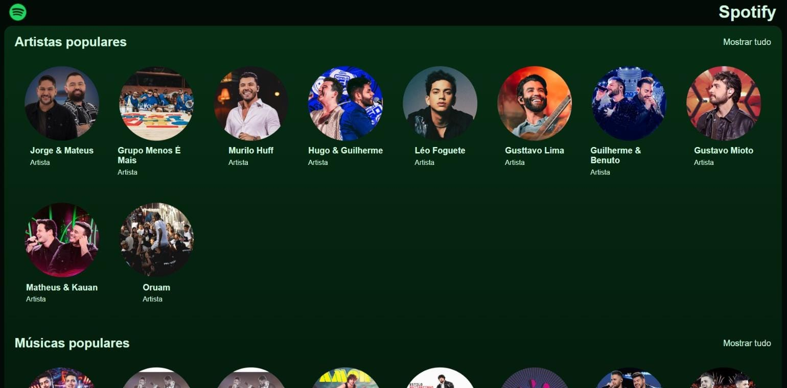
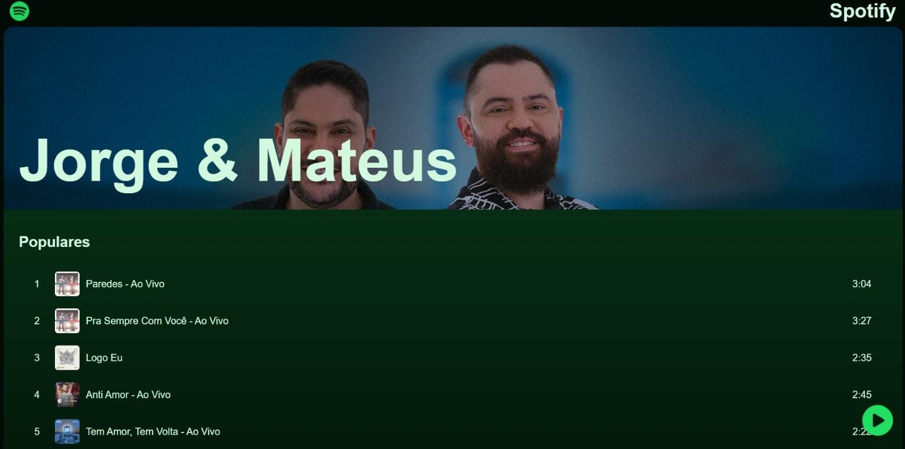

<h1 align="center" style="font-weight: bold;">Spotify Project</h1>


<p align="center">
    <b>A simplified clone project of the Spotify app, created during the "Jornada Full Stack" event by the Hashtag Programação channel.</b>
</p>

<p align="center">
     <a href="https://deploy-jornada-full-stack-8vyg.onrender.com">📱 Visit this Project</a>
</p>

<h2 id="layout">🎨 Layout</h2>

<p align="center">
    
    
</p>

<h2 id="started">🚀 Getting started</h2>

<h3>Prerequisites</h3>

Prerequisites to run this project:

- [NodeJS](https://github.com/)
- [Git 2](https://github.com)
- [Javascript ES7+](https://github.com)

<h3>Cloning</h3>

```bash
git clone https://github.com/SamuelFortes/deploy-jornada-full-stack.git
```

<h3>Starting</h3>

```bash
npm run build
npm run start
```

<h3>Documentations that might help</h3>

[📝 How to create a Pull Request](https://www.atlassian.com/br/git/tutorials/making-a-pull-request)

[💾 Commit pattern](https://gist.github.com/joshbuchea/6f47e86d2510bce28f8e7f42ae84c716)
